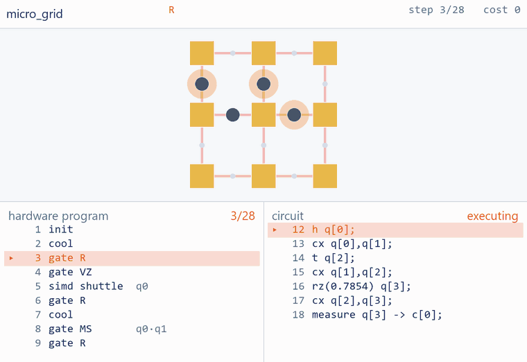

# `Compiler/` — QASM in, hardware instructions out

A verified compiler from OpenQASM to TSIR, the hardware instruction format the rest of this
repository already replays, rule-checks and prices.

**Read [`PLAN.md`](PLAN.md) first.** It states what is being built, why the trust architecture is
shaped the way it is, and what each milestone has to prove.

The one-sentence version: `qccd/verify` reported 22 of its 23 rules on any program and skipped
**R10 — "the compiled program implements the input circuit"** — because there was no QASM front end
to check against. This directory is the front end, and **R10 now reports `passed`**, decided by a
checker written in Lean and proved sound there (`QCCDC.Cert.check_sound`, axioms: `propext` only).

## Status

| milestone | state |
|---|---|
| **C0** interface: OCaml ⇄ Python JSON, validated against the 397 184 / 8 808 oracle | ✅ done |
| **C1** QASM front end + DAG, 507/507 vs `circuit_to_dag` | ✅ done |
| **C2** native gate set + Lean pulse theorems (6 theorems, no `sorry`) | ✅ done |
| **C3** place + route + aggregate → end-to-end compile, R10 `partial` | ✅ done |
| **C4** SAT routing + optimality oracle | ✅ done |
| **C5** placement relaxation + the (runtime, error) frontier | ✅ done |
| **C6** Lean verified checker, **R10 `passed`** | ✅ done |
| **C7** oracle reproduction — rigid rotation; BB[[144,12,12]] compiles and passes R10 (§11.9) | ◐ partial |

C7 is ◐ because Cyclone's external oracle is still unattempted, not because the ring is.
`qccdc rotate` compiles BB[[144,12,12]] on `ring144_24v` — which the general router cannot
route at all, it stops at 46% loop occupancy — in 776 hops against the shipped Python
pipeline's 2 672, with all 20 checkable rules and R10 `passed`:

### Watching one run



One command builds both devices, compiles `examples/micro.qasm` to each, verifies
them, renders the clips and prints the comparison:

```bash
python bridge/micro_demo.py --gif
```

`--qasm` gives the animated page a second listing -- the circuit -- and steps it with the
hardware. The statement the executing instruction is discharging is lit; the statements a
shuttle is travelling towards are shaded; clicking a statement jumps to the instruction
that discharges it. `python -m qccd studio --tsir ... --qasm ...` opens the same thing
inside the design tool.

```bash
python bridge/render.py build/out/steane.cooled.tsir.json \
    --arch arch/grid9x9.arch.json --qasm examples/steane_esm.qasm \
    -o ../out/compiled/steane_debug.html
#   circuit: 36 statements, 55 instructions discharge one and 21 shuttle towards one
```

The join is *checked*, not asserted. Every instruction carries `meta.op` -- the circuit
operations it serves, stamped as the compiler emitted it -- because the certificate's gate
witnesses are far too sparse to drive a page (10 of 50 gate instructions on
`steane_esm/grid9x9`; 690 of 3,018 on the BB rotation schedule). Those sparse witnesses
are then used to *verify* the dense stamps: if any witness disagrees with the stamp on the
instruction it names, `qccd.ir.source_map` raises and nothing is drawn. Building it that
way immediately found that a witness's `instr` field had always named the last instruction
of the whole layer rather than one that performs the operation -- harmless while nothing
read it, wrong the moment something did.

`compile` reaches it on its own -- rotation is tried only after the general router
declines, so it can add programs that compile but never change one that already did:

```bash
cd Compiler
ocaml/_build/default/bin/qccdc_cli.exe compile build/bb144_esm.qasm \
    --arch build/ring144_24v.expanded.json -o build/out/bb144_rot
python bridge/mk_qcheck_input.py build/out/bb144_rot \
    --arch build/ring144_24v.expanded.json -o build/qc_bb144.json
python bridge/check_cert.py build/out/bb144_rot --qasm build/bb144_esm.qasm \
    --arch arch/ring144_24v.arch.json --qcheck build/qc_bb144.json   # ~5 min in Lean
```

## Build and run

Three toolchains, all present on this machine and all pinned:

```bash
# OCaml 5.3.0 / dune 3.19.0 / yojson 2.2.2  -- `ocaml` is NOT on PATH by default
cd Compiler/ocaml && source ./ocamlenv.sh && dune build

# the C0 gate: expand every architecture, export every fixture, round-trip them all,
# and replay the result against the oracle
bash Compiler/run_c0.sh

# the C1 gate: generate 507 circuits, parse with both front ends, compare, then
# prove the comparator can fail by mutating our side seven ways
bash Compiler/run_c1.sh

# the C2 gate: derive the pulse identities, prove them in Lean, check the OCaml
# table against the defining unitaries, decompose the whole corpus
bash Compiler/run_c2.sh

# the C3 gate: compile 4 circuits onto 6 architectures, insert cooling, check all
# 23 rules, and discharge R10 against the certificate
bash Compiler/run_c3.sh

# the C4 oracle: re-solve the router's own sub-problems exactly, and price the
# broadcast constraint by solving each one twice
bash Compiler/run_c4.sh

# the C5 sweep: which placement relaxation actually wins, and the
# (runtime, gate error) frontier traced by the cooling budget
bash Compiler/run_c5.sh

# the C6 gate: build the proved Lean checker, run it on every compiled program,
# and seed 11 defects it has to reject
bash Compiler/run_c6.sh

# or all of it, plus the verification matrix
bash Compiler/run_all.sh
```

Lean is pinned to `leanprover/lean4:v4.29.0-rc2` with Mathlib rev `3542f17d`, matching the
**prebuilt** cache in `LeanQEC/.lake/packages` (7,676 `.olean`). Do not bump either without
intending a multi-hour rebuild.

## Layout

| | |
|---|---|
| [`PLAN.md`](PLAN.md) | the design: trust architecture, SAT encoding, milestones |
| [`ocaml/lib/tsir.ml`](ocaml/lib/tsir.ml) | TSIR reader/writer — a faithful mirror of `qccd/ir/tsir.py` |
| [`ocaml/lib/arch.ml`](ocaml/lib/arch.ml) | the expanded architecture, and the routing-regime classifier |
| [`ocaml/lib/qasm.ml`](ocaml/lib/qasm.ml) | OpenQASM 2.0 lexer and recursive-descent parser |
| [`ocaml/lib/circuit.ml`](ocaml/lib/circuit.ml) | register flattening, broadcast, and the dependency DAG |
| [`ocaml/lib/gateset.ml`](ocaml/lib/gateset.ml) | the native gate set — the two Lean theorems, as code |
| [`ocaml/lib/gateset_composites.ml`](ocaml/lib/gateset_composites.ml) | composite gates, custom-gate inlining, and the n-qubit self-test |
| [`lean/QCCDC/Pulse/`](lean/QCCDC/Pulse/) | `Native.lean`, `Decompose.lean` — obligation O2 |
| [`ocaml/lib/traps.ml`](ocaml/lib/traps.ml) | the trap graph: what one machine cycle can move an ion between |
| [`ocaml/lib/place.ml`](ocaml/lib/place.ml) | placement — greedy weighted insertion |
| [`ocaml/lib/route.ml`](ocaml/lib/route.ml) | the router: prioritised space-time A*, with the rules as its reservation table |
| [`ocaml/lib/compile.ml`](ocaml/lib/compile.ml) | the pipeline, and TSIR emission |
| [`ocaml/lib/cert.ml`](ocaml/lib/cert.ml) | the certificate R10 is discharged against |
| [`lean/QCCDC/Cert/`](lean/QCCDC/Cert/) | `Check.lean` (the specification), `Sound.lean` (proved), `qcheck` (compiled) |
| [`bridge/mutate_cert.py`](bridge/mutate_cert.py) | 11 seeded defects the checker has to reject |
| [`bench/`](bench/) | the C1 corpus: 7 named circuits + 500 seeded random ones |
| [`ocaml/bin/qccdc_cli.ml`](ocaml/bin/qccdc_cli.ml) | `qccdc` — the CLI |
| [`bridge/`](bridge/) | Python side of the interface: export, replay, diff |
| [`solver/route_sat.py`](solver/route_sat.py) | the untrusted SAT oracle, and the independent legality re-check |
| [`bridge/c4_gap.py`](bridge/c4_gap.py) | the optimality gap and the price of broadcast control |
| [`run_c0.sh`](run_c0.sh) | the C0 acceptance gate |

## What C4 measured

One waveform per named loop is what makes this hardware different from ordinary
multi-agent pathfinding. Solving each of the router's own sub-problems twice — once with
that constraint, once without — prices it:

```
clifford12 / grid9x9       direct-wired   0 cycles   binds on 0/8   <- the control
clifford12 / cyclone_base  broadcast      5 of 29    binds on 4/8   (17%)
qft6       / h2_racetrack  broadcast      9 of 37    binds on 8/8   (24%)
```

The heuristic router is optimal on every instance of the first two; on the racetrack the
oracle found two instances at 43 and 39 cycles where 5 suffice, and fixing one of them
halved the aggregate gap. See [`PLAN.md`](PLAN.md) §11.6.

## The verification matrix

`python Compiler/bridge/run_matrix.py` — 9 examples (GHZ, QFT, Bernstein-Vazirani, a
ripple-carry adder, Steane and surface-17 syndrome extraction, a repetition round) on all
9 shipped architectures:

```
81 (circuit, architecture) pairs
  53 fully verified   -- compiled, all rules pass, R10 passed
  16 partial          -- legal, R10 not fully established (non-Clifford)
  12 out of reach     -- device too small, or the heuristic router declined
   0 DEFECTS
```

## What C5 measured

Cooling frequency is a continuous exchange rate between time and accuracy. Sweeping the R7
budget on `clifford12`/`grid9x9` traces it:

```
budget  64 -> 18.21 ms, gate error 3.8486,  1 cool
budget  16 -> 31.11 ms, gate error 0.4420, 46 cools
budget   1 -> 39.81 ms, gate error 0.1711, 75 cools
```

**2.19× in runtime for 22.5× in error.** The three shipped policies (`fastest`, `coolest`,
`balanced`) all land at the slow, accurate end — not dominated, but not a *choice* either.

Spectral placement was predicted to beat greedy insertion and **lost on every instance**;
the hill-climb on the true objective won instead (up to 12%). See [`PLAN.md`](PLAN.md) §11.7.

## The interface

JSON on disk is the *only* coupling between the three languages. Nothing is shared but documents,
so every stage is independently runnable and independently diffable.

```
python bridge/export_arch.py arch/ring144_24v.arch.json -o build/ring144_24v.expanded.json
python bridge/export_deck.py -o build/deck24.tsir.json

cd ocaml && dune exec bin/qccdc_cli.exe -- arch ../build/ring144_24v.expanded.json
           dune exec bin/qccdc_cli.exe -- roundtrip ../build/deck24.tsir.json -o ../build/out.tsir.json

python bridge/diff_tsir.py  build/deck24.tsir.json build/out.tsir.json
python bridge/check_tsir.py build/out.tsir.json --model deck \
       --expect-cost 397184 --expect-steps 8808
```

**Python owns expansion.** A generator (`ring(72, 2, 24)`) expands into an explicit graph, and
expansion is where node degree — hence what counts as a junction (R18) — and loop corners are
derived. OCaml never recomputes any of it; it reads the expanded document and checks its own
adjacency against the degrees the document declares, so a misparse is loud rather than silent.

## What the compiler knows that the verifier does not

`Arch.regime` classifies a device by how hard its routing problem actually is — and the answer is
set by the *wiring*, not the geometry:

```
ring144_24v      broadcast, 144/168 segments on a named loop   -> conveyor
deck_unit_cell   broadcast, 0/288 segments on a named loop     -> broadcast-free
grid9x9          direct,    0/288 segments on a named loop     -> free
```

`grid9x9` and `deck_unit_cell` are the same 225-node lattice with 5,760 versus 44 DACs. R4d judges
only moves along a named loop, so on `deck_unit_cell` it judges nothing and reports *not judged* —
honestly, but permissively. The router therefore imposes channel drivability itself there, and says
so in its pass report. See [`PLAN.md`](PLAN.md) §6.
