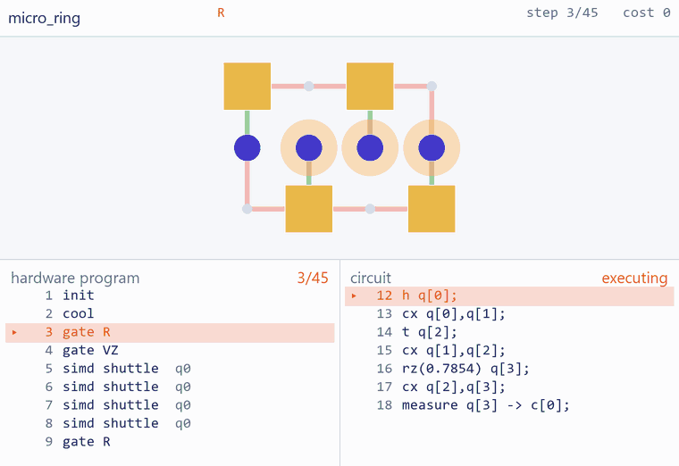

<div align="center">

# QCCD

**A fault-tolerant algorithm and trapped-ion architecture codesign tool**

Design a machine · compile a circuit for it · prove the result runs · derive the metal

[](https://www.python.org/downloads/)
[](LICENSE)
[](#install)
[](docs/rules.md)
[](Compiler/)

</div>

In a QCCD machine, ions are transported between traps to be brought together for gates.
Traps fill up, junctions heat the ions that cross them, and one broadcast waveform drives
every site wired to it identically — so moving two neighbouring ions past one another may
not be realisable at all. Which architecture wins is therefore not self-evident: it depends
jointly on the code, the transport schedule, and the wiring.

**This is a platform for answering that quantitatively.** Describe a device declaratively,
compile a circuit onto it, and the tool replays the result, checks twenty-three hardware
rules, prices it, and derives the electrodes it would take to build.

## Install

No dependencies — pure standard-library Python.

```bash
git clone https://github.com/yezhuoyang/QCCD.git && cd QCCD
python -m qccd devices          # every architecture, and what it costs to wire
python -m qccd studio           # the design tool, as one self-contained page
```

---

## What it can do

### Design a machine in the browser

Drag a trap, draw a segment, and the cost model and all 23 rules re-evaluate as you go.
One parameter here — the number of vertical shuttling lines — trades ancillas against
junctions.


→ [**qccd/README.md**](qccd/README.md) for the Python API, the document format and every command

### Evaluate it against the rules

`run` replays the program instruction by instruction and reports what the rules say. They
bite: three ions into a capacity-2 trap fails **four** of them — `R1 R2 R4 R11` — and the
interesting one is `R4`, because a single broadcast channel cannot ask 168 sites to do two
different things in one cycle.


→ [**docs/rules.md**](docs/rules.md) for all 23

### Compile any QASM circuit onto any device

Four qubits, seven statements, two twelve-trap machines. Under the stage sit **two
listings** — the hardware program and your circuit — and the page steps both. Orange is the
gate firing; teal is the machine still travelling.


The same circuit on the same twelve traps, wired as a loop instead of a lattice:



| same circuit, same trap count | `micro_grid` | `micro_ring` |
|---|---:|---:|
| transport instructions | **5** | 22 |
| cost | **15** | 33 |
| runtime | **2.045 ms** | 2.615 ms |
| R10, by the proved Lean checker | **passed** | **passed** |

**1.28× faster on identical hardware budget**, and the reason is one row: a lattice gates
where the ions already are; a ring has four gate zones and must carry every pair to one.

→ [**Compiler/README.md**](Compiler/README.md) for the compiler, the proof, and the SAT oracle

### Derive the electrodes it implies

A device plus a technology file determines the metal. Nothing is authored — no `.arch.json`
changes, no field added to a trap. Integer-nanometre polygons, the RF pseudopotential in
closed form, GDSII and SVG from one shape table.

→ [**docs/phys.md**](docs/phys.md) · `python -m qccd phys ring144_24v --svg out/m.svg`

---

## What has been established

| | |
|---|---|
| **R10 is no longer skipped** | *"the compiled program implements the input circuit"* shipped as unchecked, for a stated reason: it needs symbolic permutation and Pauli-frame tracking against a QASM DAG. It is now **decided by a checker proved in Lean 4** — 31 theorems, no `sorry` — plus a stabilizer-tableau check of the emitted pulses. [How](Compiler/README.md) |
| **72 of 81 verified, 0 defects** | nine circuits × nine architectures, compiled, all rules passing, R10 passed. The nine out of reach decline loudly rather than emitting something illegal. |
| **`BB [[144,12,12]]` compiles** | the individual-ion router stops at 46.2% loop occupancy and the round needs 53.8%. Rigid rotation moves every ion with one instruction: **776 ion-hops** against the shipped pipeline's 2,672. |
| **The shipped artifact reproduces exactly** | 397,184 cost / 8,808 steps, all rules pass — the oracle everything else is measured against. |
| **The junction cost is a checked number** | fed only the two RF widths arXiv:2201.12579 publishes, the field solver reproduces that paper's own naive-junction measurement: **86.5 µm** transport path against their 84. It also finds no shipped device sits at its design ion height — neighbouring metal moves it by up to 15%. |
| **Zero dependencies** | the whole toolchain is standard-library Python. Pages are single self-contained HTML files. |

---

## The gallery

Nine reference architectures, every one from a published design. Identical geometry,
different wiring — and the wiring is the whole cost.

<table>
<tr>
<td width="50%"><br>
<b>ring144_24v</b> — the shipped 24-ancilla design.<br>397,184 cost / 8,808 steps.</td>
<td width="50%"><br>
<b>cyclone_base</b> — no junction on the rotation path.<br>1,296 cost / <b>18 steps</b>.</td>
</tr>
<tr>
<td><br>
<b>grid9x9</b> — direct drive.<br><b>5,760 DACs</b>.</td>
<td><br>
<b>deck_unit_cell</b> — the same lattice, broadcast.<br><b>44 DACs</b>.</td>
</tr>
</table>

→ [**arch/README.md**](arch/README.md) for all nine, the clips, and the side-by-side table

---

## What is in the box

| | |
|---|---|
| [`qccd/`](qccd/README.md) | the platform: the language, the IR, the 23 rules, the cost model, the renderer |
| [`Compiler/`](Compiler/README.md) | QASM → hardware instructions: OCaml search, Lean-verified checker |
| [`arch/`](arch/README.md) | nine reference architectures |
| [`examples/`](examples/) | runnable studies — routing benchmarks, heating budgets, `BB [[144,12,12]]` |
| [`docs/`](docs/) | [design plan](docs/PLAN.md) · [architecture language](docs/adl.md) · [control IR](docs/tsir.md) · [the rules](docs/rules.md) · [the electrodes](docs/phys.md) |

## Where this is going

- **Near term** — for `BB [[144,12,12]]`, which architecture is best? The compiler makes
  that a measurement rather than an argument: same circuit, every device, verified output.
- **Long term** — which code *and* architecture together give the cheapest demonstration
  of break-even?

Contributions welcome — see [qccd/README.md](qccd/README.md#tests).

## License

[MIT](LICENSE)
