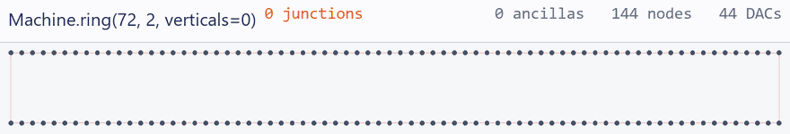

<div align="center">

# QCCD

**Design a trapped-ion QCCD architecture, put a program on it, and get a number back.**

[](https://www.python.org/downloads/)
[](LICENSE)
[](#install)

</div>

In a QCCD machine ions are shuttled between traps to meet for gates. Every trap has a
finite capacity, so a full trap blocks the ions behind it. Every junction an ion crosses
heats it. And one broadcast waveform makes every site it drives do **the same thing** — so
"move these two ions past each other" may not be a step the hardware can take at all.

Which architecture wins therefore is not obvious: it depends on the code, on the schedule,
and on the wiring. This is a platform for asking. Describe a device, write or compile a
program for it, and the tool replays it, checks 23 hardware rules against it, and prices it.

## Install

No dependencies — the toolchain is pure standard-library Python.

```bash
git clone https://github.com/yezhuoyang/QCCD.git && cd QCCD
python -m qccd devices          # every architecture in arch/, and what it costs to wire
```

## 1 · Design an architecture



A device is a **graph of traps and the segments between them**. Nothing declares "this is a
junction": attach a spur to a rail node and it *becomes* degree 3, and the cost model finds
that out by counting. Above, one parameter — the number of vertical shuttling lines — trades
ancillas against junctions.

Three ways in, all producing the same object:

```python
from qccd import Machine

m = Machine.ring(width=72, height=2, verticals=24, name="my_ring")   # a generator
#   Machine.grid(9, 9)                              …or a lattice
#   Machine.load("arch/ring144_24v.arch.json")      …or a document on disk

m.set_zone("data", capacity=4)                          # retune the device
m.set_curve("shuttle_segment", [(5, 0.10), (12, 1.0)])  # its (µs, quanta) physics
m.save("arch/my_ring.arch.json")
```

- **Python** — `qccd.Machine`, above. See [examples/program_in_python.py](examples/program_in_python.py).
- **A document** — [`arch/*.arch.json`](arch/), the architecture description language ([docs/adl.md](docs/adl.md)).
- **A browser** — `python -m qccd studio -o out/studio.html` opens a design tool as one
  self-contained page: drag traps, draw segments, write the program. `python -m qccd open
  my_design.qccd.json` brings it back for the full verifier.

Then program it. Space is node ids, time is cycles, and **one cycle is one machine step**:

```python
p = m.program("one_turn")
p.init({f"d{i}": f"S{i}" for i in range(144)})
p.rotate(+13)                                      # one template, every ion
```

## 2 · Evaluate it


`run` replays the program instruction by instruction, charges every hop to a cost model,
and reports what the [23 rules](docs/rules.md) say about it:

```python
r = m.run(p)                          # replay + every rule + the objective
r.cost, r.steps, r.runtime_ms, r.rules_failed
m.render(p, "out/my_ring.html")       # one self-contained, animated page
```

A rule reports *passed* only if the check actually ran — otherwise it says `skipped`, with
the reason. And the rules bite:

```python
bad = m.program("squeeze")
bad.init({"d0": "S0", "d1": "S1", "d2": "S143"})
with bad.cycle("shuttle") as c:                    # one machine step
    c.move("d1", "S1", "S0")
    c.move("d2", "S143", "S0")

m.run(bad).rules_failed
# ['R1', 'R11', 'R2', 'R4']
#  [R1] site S0 holds 3 ions but capacity is 2
#  [R2] 2 ions cross junction S0 in one cycle
#  [R4] channel 'linear_h.all.0' drives 168 sites with one waveform, but they are
#       asked to do 2 different things (L0:+1 and L0:-1); that needs 2 channels
```

Beyond a single run, `python -m qccd sweep` varies one design knob and prints the curve —
the question an architect actually asks:

```console
$ python -m qccd sweep budget ring144_24v scale.junction 0.25,0.5,1,2
budget on ring144_24v: scale.junction over 4 settings
scale.junction     total_error   heating_error     floor_error  dominant_share
------------------------------------------------------------------------------
0.25                  671.7777        670.1880          1.5898          0.4381
0.5                   965.3922        963.8025          1.5898          0.6093
1                    1552.6212       1551.0315          1.5898          0.7572
2                    2727.0792       2725.4895          1.5898          0.8618
```

Junction heating is 76% of the summed gate error at nominal — which is what makes the
number of vertical shuttling lines a design decision rather than a detail. See
`python -m qccd analyses` for the rest, and `python -m qccd reach <device>` for what a
machine can do before anyone writes a program for it.

## The gallery

Every clip below is generated from the checked-in architecture by
`python tools/make_gif.py --all`, through the same layout and replay code that renders the
interactive pages. Pale dots are empty traps, gold squares are junctions, dark blue dots
are data ions and indigo dots ancillas; pink segments are the data region, green the
computing region and blue the shuttling highways. (The `ring144_24v` clip replays a
schedule imported from a third-party artifact that is not in the repo; without it that one
clip is skipped and the rest still build.)

### Rotation loops

**`ring144_24v`** — the shipped 24-ancilla design: a 2×72 rotation loop with 24 dock spurs.
The spurs are what put a junction on every rigid hop. Replaying its schedule reproduces the
artifact exactly: **397,184 cost / 8,808 steps**, all rules pass.


**`cyclone_base`** — 72 traps on one loop, ancillas in line, so **no junction sits on the
rotation path**. One instruction turns the whole register: 1,296 cost / 18 steps.


**The same realignment by odd-even sort**, for contrast — 143 instructions of pairwise
swaps: 3,888 cost / 284 steps. Rigid rotation wins by 3× in cost and nearly 16× in steps.


**`cyclone_dual_loop`** — one data loop and one ancilla loop, concentric. The data loop
holds still while the ancilla loop turns past it; two turns finish the syndrome extraction.


**`h2_racetrack`** — Quantinuum H2, a linear trap with periodic boundary conditions. One
continuous RF null, so the curved ends are ordinary conveyor regions and the device has **no
junctions at all**.


### Grids and rails

Identical geometry, different wiring — and the wiring is the whole cost. Both are 225 nodes,
144 traps, 77 junctions; `grid9x9` drives every electrode directly, `deck_unit_cell`
broadcasts in groups behind a demux.

<table>
<tr>
<td width="50%"><br>
<b>grid9x9</b> — baseline grid QCCD, a trap in the middle of every wire.<br><b>5,760 DACs</b>, direct.</td>
<td width="50%"><br>
<b>deck_unit_cell</b> — the same lattice, 24 electrodes per cell in three classes.<br><b>44 DACs</b>, broadcast.</td>
</tr>
</table>

**`ladder_2x72`** — rails and highways: two 72-slot rails joined by rungs (the computing
region, green), plus top and bottom shuttling highways (blue) an ion can be ejected onto,
run along, and re-inserted from.


### Baselines

**`chain72`** — the unrolled ring: the same 144 ion slots with no loop, no spur and no
junction. The control the ring's topology is measured against.


**`stationary_chain`** — one trap, no transport: the degenerate case the platform has to
express without special-casing, and the baseline that already demonstrated break-even.


### Side by side

| device | nodes | traps | junctions | DACs | wiring | program | cost | steps |
|---|---:|---:|---:|---:|---|---|---:|---:|
| ring144_24v | 168 | 168 | 24 | 46 | `wise` | deck schedule | 397,184 | 8,808 |
| cyclone_base | 72 | 72 | 0 | 38 | `broadcast_groups` | rotate ×18 | 1,296 | 18 |
| cyclone_base | 72 | 72 | 0 | 38 | `broadcast_groups` | odd-even ×18 | 3,888 | 284 |
| cyclone_dual_loop | 144 | 144 | 0 | 44 | `broadcast_groups` | rotate ×18 | 1,296 | 18 |
| h2_racetrack | 40 | 40 | 0 | 72 | `broadcast_groups` | rotate ×10 | 400 | 10 |
| ladder_2x72 | 288 | 288 | 46 | 56 | `wise` | walk ×20 | 1,284 | 55 |
| grid9x9 | 225 | 144 | 77 | 5,760 | `direct` | walk ×8 | 184 | 16 |
| deck_unit_cell | 225 | 144 | 77 | 44 | `wise` | walk ×8 | 184 | 16 |
| chain72 | 72 | 72 | 0 | 1,728 | `direct` | walk ×12 | 720 | 60 |
| stationary_chain | 2 | 2 | 0 | 48 | `direct` | walk ×1 | 1 | 1 |

`wise` and `broadcast_groups` are both broadcast schemes: the DAC count stays flat as the
array grows, and only the per-trap compensation electrodes scale. `direct` pays one DAC per
electrode — which is why the same 144-trap lattice costs 5,760 DACs or 44.

Reproduce the whole table with `python -m qccd devices` and `python -m qccd demo`, which
renders every device to `out/index.html`.

## What is in the box

| | |
|---|---|
| [`qccd/arch/`](qccd/arch/) | the architecture description language and its generators |
| [`qccd/ir/`](qccd/ir/) | TSIR, the control IR a hardware program is written in |
| [`qccd/verify/`](qccd/verify/) | the replay and the 23 rules, as machine-checkable invariants |
| [`qccd/cost/`](qccd/cost/) | the objective: combinatorial (steps, templates) and physical (µs, quanta) |
| [`qccd/compile/`](qccd/compile/) | placement, ordering, cooling insertion, the program builders |
| [`qccd/viz/`](qccd/viz/) | the renderer, and the browser design tool it emits |
| [`arch/`](arch/) | nine reference architectures, every one from a published design |
| [`examples/`](examples/) | runnable studies — routing benchmarks, heating budgets, `BB [[144,12,12]]` |
| [`tools/make_gif.py`](tools/make_gif.py) | the clips above (needs Pillow: `pip install pillow`) |

**Docs** — [design plan](docs/PLAN.md) · [architecture language](docs/adl.md) ·
[control IR](docs/tsir.md) · [the rules](docs/rules.md)

## Where this is going

- **Near term** — for `BB [[144,12,12]]`, which architecture is best?
- **Long term** — which code *and* architecture together give the cheapest demonstration
  of break-even?

Contributions welcome: a new architecture is a `.arch.json` in [`arch/`](arch/), a new
routing strategy is a builder in [`qccd/compile/programs.py`](qccd/compile/programs.py), and
a new claim about hardware is a rule in [`qccd/verify/rules.py`](qccd/verify/rules.py) with a
test that breaks it. Run the suite with `python -m pytest`.

## License

[MIT](LICENSE)
