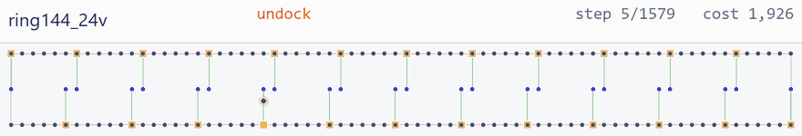
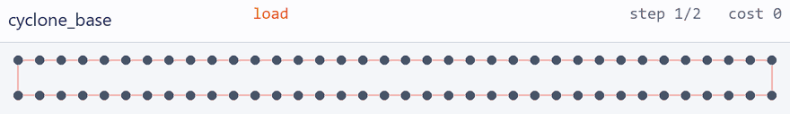
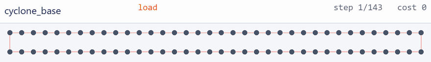
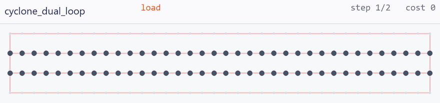
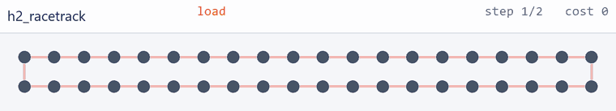
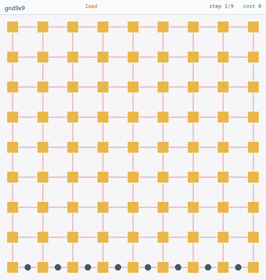
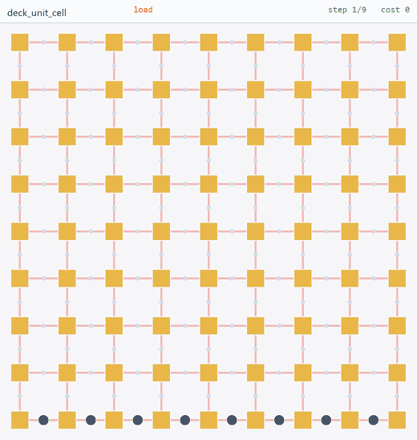
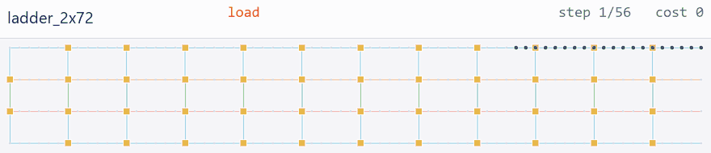
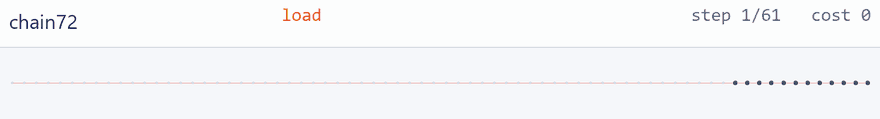
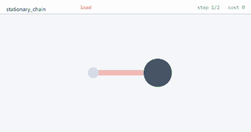

# The nine reference architectures

Every device here is a `.arch.json` document in the [architecture description
language](../docs/adl.md), and every one comes from a published design. Reproduce the
whole table with `python -m qccd devices`, and every clip with
`python tools/make_gif.py --all`.

The clips are generated from the checked-in architecture through the same layout and replay
code that renders the interactive pages. Pale dots are empty traps, gold squares are
junctions, dark blue dots are data ions and indigo dots ancillas; pink segments are the data
region, green the computing region and blue the shuttling highways. (The `ring144_24v` clip
replays a schedule imported from a third-party artifact that is not in the repo; without it
that one clip is skipped and the rest still build.)

---

## Rotation loops

**`ring144_24v`** — the shipped 24-ancilla design: a 2×72 rotation loop with 24 dock spurs.
The spurs are what put a junction on every rigid hop. Replaying its schedule reproduces the
artifact exactly: **397,184 cost / 8,808 steps**, all rules pass.

**`cyclone_base`** — 72 traps on one loop, ancillas in line, so **no junction sits on the
rotation path**. One instruction turns the whole register: 1,296 cost / 18 steps.

**The same realignment by odd-even sort**, for contrast — 143 instructions of pairwise
swaps: 3,888 cost / 284 steps. Rigid rotation wins by 3× in cost and nearly 16× in steps.

**`cyclone_dual_loop`** — one data loop and one ancilla loop, concentric. The data loop
holds still while the ancilla loop turns past it; two turns finish the syndrome extraction.

**`h2_racetrack`** — Quantinuum H2, a linear trap with periodic boundary conditions. One
continuous RF null, so the curved ends are ordinary conveyor regions and the device has **no
junctions at all**.

## Grids and rails

Identical geometry, different wiring — and the wiring is the whole cost. Both are 225 nodes,
144 traps, 77 junctions; `grid9x9` drives every electrode directly, `deck_unit_cell`
broadcasts in groups behind a demux.

<table>
<tr>
<td width="50%"> 
<b>grid9x9</b> — baseline grid QCCD, a trap in the middle of every wire. <b>5,760 DACs</b>, direct.</td>
<td width="50%"> 
<b>deck_unit_cell</b> — the same lattice, 24 electrodes per cell in three classes. <b>44 DACs</b>, broadcast.</td>
</tr>
</table>

**`ladder_2x72`** — rails and highways: two 72-slot rails joined by rungs (the computing
region, green), plus top and bottom shuttling highways (blue) an ion can be ejected onto,
run along, and re-inserted from.

## Baselines

**`chain72`** — the unrolled ring: the same 144 ion slots with no loop, no spur and no
junction. The control the ring's topology is measured against.

**`stationary_chain`** — one trap, no transport: the degenerate case the platform has to
express without special-casing, and the baseline that already demonstrated break-even.

## Side by side

| device | nodes | traps | junctions | DACs | wiring | program | cost | steps |
|---|---:|---:|---:|---:|---|---|---:|---:|
| ring144_24v | 168 | 168 | 24 | 46 | `wise` | deck schedule | 397,184 | 8,808 |
| cyclone_base | 72 | 72 | 0 | 38 | `broadcast_groups` | rotate ×18 | 1,296 | 18 |
| cyclone_base | 72 | 72 | 0 | 38 | `broadcast_groups` | odd-even ×18 | 3,888 | 284 |
| cyclone_dual_loop | 144 | 144 | 0 | 44 | `broadcast_groups` | rotate ×18 | 1,296 | 18 |
| h2_racetrack | 40 | 40 | 0 | 72 | `broadcast_groups` | rotate ×10 | 400 | 10 |
| ladder_2x72 | 288 | 288 | 46 | 56 | `wise` | walk ×20 | 1,284 | 55 |
| grid9x9 | 225 | 144 | 77 | 5,760 | `direct` | walk ×8 | 184 | 16 |
| deck_unit_cell | 225 | 144 | 77 | 44 | `wise` | walk ×8 | 184 | 16 |
| chain72 | 72 | 72 | 0 | 1,728 | `direct` | walk ×12 | 720 | 60 |
| stationary_chain | 2 | 2 | 0 | 48 | `direct` | walk ×1 | 1 | 1 |

`wise` and `broadcast_groups` are both broadcast schemes: the DAC count stays flat as the
array grows, and only the per-trap compensation electrodes scale. `direct` pays one DAC per
electrode — which is why the same 144-trap lattice costs 5,760 DACs or 44.

## Adding one

A new architecture is a document in this folder. Nothing else has to change: the cost model,
the 23 rules, the renderer and the compiler all read the same description. See
[docs/adl.md](../docs/adl.md) for the language, and
[`qccd/arch/generators.py`](../qccd/arch/generators.py) for the six generators that write
one for you.
