# Rules review — organized notes

Working notes from the discussion of [`docs/rules.md`](rules.md), reorganized from the
raw file [`notes`](../notes). Three questions were raised and are answered in §2; the rest is
the rule-by-rule audit the discussion was for: **is every rule necessary, and is anything
redundant?**

Everything marked **[verified]** below was produced by running the verifier, not by reading
it. Everything marked **[from docs]** is quoted from the repo and not independently
reproducible here (the deck artifact and the `Knowledge/` graph are not in this checkout).

---

## 1. Terminology

| term | what it means here | where it lives |
|---|---|---|
| **node** | a vertex of the expanded device graph. Two kinds: `site` (a trap slot, has `capacity` and `zone_type`) and `junction` (holds no ions, `capacity 0`) | `qccd/arch/device.py` |
| **segment** | an edge — a piece of shuttling path between two nodes. Has a `capacity` (**1 on all nine shipped devices**) | `qccd/arch/device.py` |
| **ions live on nodes, and travel along segments** | the raw note "ions on the edges" is about travel, not rest; the replay only ever stores `ion → node` | `replay.py` `pos` |
| **degree** | segment incidences of a node **in the expanded graph**. Nothing declares "this is a junction" — attach a spur to a rail node and it *becomes* degree 3 | `Device.degree` |
| **junction** | degree ≥ 3. **This is R18** and it is not a free convention — see §2.2. A degree-2 bend is *not* a junction; it is ordinary transport | R18 |
| **corner** | a property of a **loop**, not of a node: where the loop's in- and out-direction differ. `corner_endpoints[seg] == 2` means the segment contains a whole turn | `Device.corners` |
| **cycle** | one machine step. One instruction is one cycle, except a `loop_shift` template with `|delta| > 1`, which decomposes into `|delta|` unit sub-cycles, each rule-checked separately | `replay.py:123-161` |
| **class (SIMD class)** | a declared movement template. A class fixes **(type, direction)**; participation is *variadic* — each site may join or opt out via its switch. `max_simd_classes_per_cycle = 1` on all nine devices | `arch.simd_classes` |
| **broadcast** | one waveform on one channel drives every site wired to it. Declaring the movement (direction + amount) first and the participant set second is exactly what the ADL does | `control.channels` |
| **`entails`** | a property of the *class*, not of occupancy: a `dock` lifts an ion out of one potential into another, so it costs `split` + `merge`; a conveyor rotation costs neither | `arch.entails()` |

Two corrections to the raw terminology notes:

- **"Junction: degree 2, degree 3 more expensive"** — under R18 a degree-2 bend is **not** a
  junction at all and costs one ordinary shuttle. The distinction is categorical, not a
  price difference, and the whole `q_inline_vs_hanging_ancillas` question turns on it (§2.2).
  The degree-2 entry that *does* exist in every `junction_cross` curve is Cyclone's, kept for
  provenance and deliberately ignored by `CorrectedModel`. **[verified]** it is dead data
  today, but nothing asserts that.
- **"Nodes: basically means crossover of shuttling"** — that is a *junction*. A node is any
  vertex; most nodes are traps.

Every term below has a figure, and every figure is **generated by the verifier**: the
verdict under each panel is `str(Violation)` out of `verify()`, and
`tools/make_rule_figs.py` refuses to emit a figure whose observed rule set differs from
the one the spec declares. Rebuild them all with `python tools/make_rule_figs.py --all`.

### Node, segment, ion

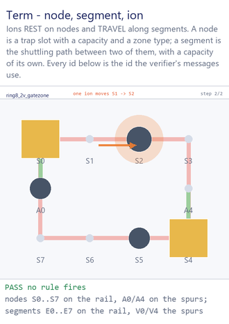

### Degree — and what makes a junction (this is R18)

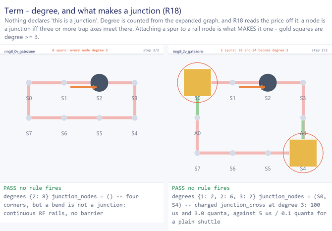

### Corner — a property of the loop, not of a node

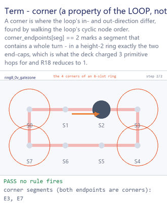

### Cycle, and the sub-cycles a template decomposes into

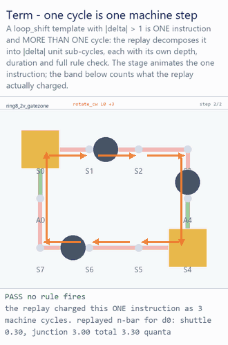

### Class, broadcast, and variadic participation

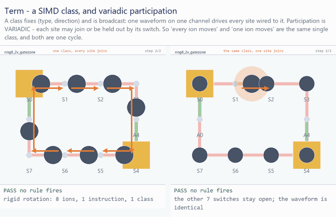

### `entails` — what a movement class costs beyond the hop

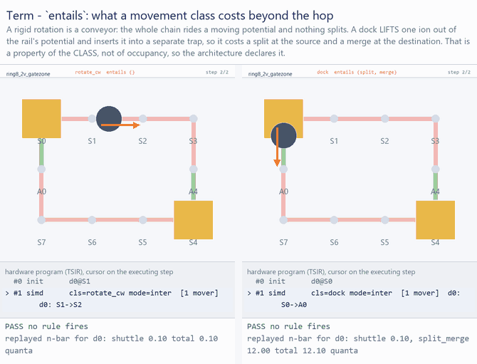

### Loop — closed, open, and none at all

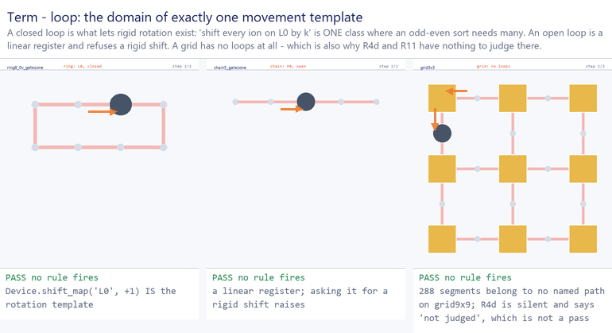

**Distance is not modelled as a cost.** `length_scaling` is off by default, and the corpus
reason is that excitation is time-dominated, not distance-dominated (2605.25118: the
near-adiabatic regime is reached within 20 µs "regardless of the transport distance"). A
broadcast shift can cross the whole chip in one cycle; it costs more only because it takes
longer.

---

## 2. The three questions

### 2.1 What does "replay" mean? What is a "replayed site"?

**Replay** = the verifier re-executes the program instruction by instruction against the
architecture graph and a cost model, maintaining **its own** ion→site map, occupancy
counters, per-ion n̄ (itemized by component: shuttle / junction / split_merge / gate /
anomalous) and clock — and recomputes every number the program claims.
(`qccd/verify/replay.py`)

Its contract is narrow on purpose:

- it owns **no cost knowledge** — every number comes from the `CostModel` handed to it, which
  is why the same program replays under the deck's model (M1) and the corrected one (M2)
  with every difference attributable to the model;
- it owns **no schedule knowledge** — instructions execute in list order, each atomically,
  and `t0`/`t1` are *computed*, so an annotation is always a **claim**;
- it carries n̄ **by component**, because one opaque total cannot be checked against a
  published budget.

**Why it exists: R9.** A TSIR program *carries* `total_cost`, `total_steps`, `t0`, `t1`,
`quanta_delta`. Those are claims. R9 is the rule that the claims equal the replayed values,
checked at three granularities — program totals, per-batch, per-instruction — *because a
total can agree by cancellation*. **[verified]** a program claiming `total_cost: 999` when
the replay computes `1.0` fails R9 and nothing else. That is the whole difference between a
verifier and a pretty-printer.

**"The replayed site"** is the answer to *where did this gate actually happen?* There are two
candidates:

1. the instruction's own `sites: ["A120"]` annotation — optional, written by whoever emitted
   the program;
2. `pos[ion]` in the replay's reconstructed map — **the replayed site**.

`CycleView.gate_sites()` (`rules.py:143`) takes the second, and R6, R6b, R12 and R13 all read
it. There is no noun "replay site" in the repo; the phrase in `docs/rules.md:34` is "at the
**replayed** site".

**Why this is load-bearing.** The earlier implementation drove R6/R6b/R13 off the `sites`
annotation — so **a program could switch those checks off by omitting the annotation**, and
the report still said `passed`. That is one of the ~24 defects the adversarial M0–M2 review
confirmed; the regression is named for the defect
(`tests/test_review_regressions.py:267`, `"omitting sites must not disable R6"`).

> **Mental model.** A TSIR program is a shot log with the analysis already filled in. The
> replay is you re-running the analysis from the raw sequence: trap map from the
> architecture, calibration table from the cost model, step forward tracking where every ion
> is, how crowded each well is, how much motional energy each ion picked up and from which
> mechanism, and how much wall clock has passed. Then compare your numbers to theirs (R9),
> and check the physics against **your** ion positions, not their labels (R6/R6b/R12/R13).

*One caveat found while checking this* — `gate_sites()` returns the replayed positions
**unioned with** the declared annotation, so the documented phrase "at the replayed site" is
really "at the replayed ∪ declared sites". **[verified]** a legal co-located gate at `A0`
that declares `sites=("S5",)` fires both R6 (*"gate at S5 whose zone type 'data' has
gate=false"* — no ion is at S5) and R6b. The bias is conservative (over-rejection only), but
the documented contract is not what the code does.

### 2.2 R18 — what it is, and why it is in the list

**Statement:** *a node is a junction only if three or more trap axes meet at it.*
**Sources:** quant-ph/0702175, 2305.03828, 1210.3655.

**The physics.** A junction is defined by its **RF barrier**: *"Shuttling through junctions,
where three or more linear trap axes join, is greatly complicated by the presence of rf
barriers leading into the junction"* (quant-ph/0702175), the barrier arising from
*"unbalanced fields produced by the electrodes across the junction"*. A two-arm bend has
continuous RF rails, no unbalanced field, and therefore no barrier — just a principal-axis
rotation handled by DC shims. Shipped hardware confirms it: Quantinuum's H2 race track is a
**single continuous RF null**, and its curved end zones are ordinary conveyor-belt regions
driven by the same `{a,b,c}` broadcast tiling as the straights (2305.03828). And an
X-junction is not something you get by drawing two lines crossing — *"a junction naively
assembled from the intersection of two linear sections does not provide adequate
three-dimensional confinement to allow controlled transport"*; the RF electrode shape must be
redesigned, and residual dielectric charging can leave an unmodelled barrier at the centre.

**Why it is a rule and not taste — trace the number.** The deck had it exactly backwards:
`DeckModel` charges a ring corner **3 primitive hops** and a degree-≥3 node **nothing**. R18
inverts both — `corner_hops = 1`, `junction_cross` charged at the degree the graph reports.
The consequences on the shipped ring **[from docs]**:

```
revolutions per ESM round        2672 / 144            = 18.56
T-junction transits per data ion 18.56 × 24            = 445
heating from junctions           445 × 3 quanta        = 1336  of the round's ~1747
wall clock, rotation only        2672 hops × 100 µs    = 267 ms, not 13 ms
measured uncooled survival       ~85 junction round trips before ION LOSS (1210.3655)
```

Because 24 of the 144 loop nodes are degree-3 and a rigid hop takes the max over all moving
ions, **every single hop crosses a junction** — the whole rotation runs at junction price.
The physical layer reaches the same verdict independently: at the technology's dimensions
`ring144_24v`'s spurs *do not fit* (`docs/phys.md`).

**How it is "checked" — bluntly, it is not.** `qccd/verify/__init__.py:282` is
`rules.checked.add("R18")`. That is a green tick for a check that did not run and cannot
fail, which the repo's own contract forbids two files over (*"A check that cannot fail is not
a check"*). What a real R18 check would be, and it is cheap:

- (a) no cost model charges a junction price below degree 3 — `CorrectedModel.junction_min_degree`
      is a free `int`; assert it is 3 (2 overcharges bends, 4 undercharges T-junctions);
- (b) no architecture declares a `kind="junction"` node at degree < 3. **[verified]**
      `add_junction(dev, "JX", 5, 5, to=["S2"])` yields `kind="junction"`, `degree == 1`, and
      `check_structure()` returns `[]`. The mispricing risk is contained — `junction_nodes`
      is derived from degree, so `JX` is *not* in it and is charged as plain transport, and
      the interactive editor does warn — but the load path accepts a node called a junction
      that is not one, and (a) is a live route back to charging it;
- (c) the degree-2 `junction_cross` entry every device ships stays unreachable;
- (d) the threshold "3" is written independently in five places (`device.py` ×2,
      `rules.py` ×2, `replay.py`) plus a settable field on the model. **R18 *is* the claim
      that these are the same number**, and asserting that is the highest-value missing line
      in the verifier.

**Is R18 a rule or a definition?**

| | statement | quantifies over |
|---|---|---|
| R2 | ≤ 1 ion on any junction | `degree(node) >= 3` |
| R11 (structural half) | every junction degree must be priceable | `dev.junction_nodes` |
| **R18** | **which nodes those are** | — nothing |

R2 and R11 are predicates on program state. **R18 has no free program variable at all** — it
is the interpretation function for the word "junction" in the other two. Formally it is a
definition, and the docs half-agree by accident: R18 is *absent from PLAN §5's rule table*,
which runs R1…R17 and stops.

**Keep it, but make it fail.** Three reasons it earns a slot: (1) in this codebase the
definition has **four independent implementations that can disagree**, and a definition with
more than one implementation is a contract; (2) it was a finding *against a source*, and
demoting it to a glossary entry drops the citations that stop the deck's convention creeping
back as taste; (3) it is the only entry whose retraction changes an architectural verdict by
20× in time and 30× in heating. Move it into `architecture_violations` as a
`(model, architecture)` admissibility check with a negative test — or move it to a
**Definitions** section and take it out of `passed`. "By construction" and "passed" cannot
both be true of the same line.

**The design consequence.** `q_inline_vs_hanging_ancillas` — in-line ancillas (no degree-3
node on the rotation path) or hanging on spurs — **is R18 and nothing else**. Under the raw
notes' reading (degree-2 cheap, degree-3 dearer) it is a marginal cost comparison the spurs
probably win, because they cut rotation hops ~6×. Under R18 it is categorical: 20× time, 30×
heating, past an ion-loss limit, and not fabricable. There is also a fourth consequence found
during this audit and **[verified]**: odd–even sort on `ring144_24v` fails **R2 with 864
violations** (a transposition parks both ions of a pair in one slot, and 24 of the 144 rail
slots are degree-3 where R2 allows exactly one) while the same program on `cyclone_base` is
clean. **The verticals do not merely tax the rotation path — they make the rival
reconfiguration scheme structurally illegal on the same hardware**, which is why the thesis
experiment `q_rotation_beats_oddeven` has to be run on `cyclone_base`.

### 2.3 Why ε(n̄) = ε₀ + κ·n̄ makes sense — the theory behind R16

The repo implements `ε = ε₀ + 2.0e-3 · n̄` with ε₀ = 1 − 0.99816 = **1.84×10⁻³** (H2's
measured 2Q infidelity, 2305.03828) and R7's budget `max_quanta = 1.0`.

**The short answer:** the linear law is the **first-order Taylor expansion of a smooth
ε(n̄) about n̄ = 0**, and it is licensed not by the physics being linear everywhere but by
**R7 refusing to evaluate it anywhere else**. `max_quanta` is simultaneously the physics
budget and the declared validity domain of `error_vs_quanta`. They are a matched pair, and
the repo never says so.

#### (a) Why n̄ *nominally* does not appear at all

Two ions in one well share the normal modes of the Coulomb crystal. A Mølmer–Sørensen gate
drives red and blue sidebands together; in the Lamb–Dicke regime the Hamiltonian is

```
H = ℏ η Ω Σⱼ σ_φ⁽ʲ⁾ ( a e^{−iδt} + a† e^{+iδt} )
```

`[H(t), H(t′)]` is a c-number, so the Magnus series terminates and the propagator is exact:

```
U(t) = D( α(t)·S_φ ) · exp[ i Φ(t) S_φ² ]
α(t) = (ηΩ/δ)(1 − e^{iδt})     — a circle in phase space, closing at t_g = 2π/δ
Φ(t) = (ηΩ/δ)²(δt − sin δt)    — twice the enclosed area
```

`D(α)` is a **rigid translation** of phase space: the enclosed area does not depend on where
the blob started. The gate phase is identical for |0⟩, |n⟩, a coherent state or a thermal
mixture. **This "hot gate" property is why a QCCD machine can exist at all** — contrast
Cirac–Zoller, which uses |n=0⟩ as a computational level and fails outright for n > 0. If MS
were CZ-like, `error_vs_quanta` would be a cliff at n̄ ≈ 0, not a gentle slope.

The insensitivity is only first order, because the phase survived only after truncating
`exp[iη(a+a†)]` at O(η), and the loop closed only because δ exactly matched ω. Both are what
n̄ breaks.

#### (b) Where the n̄ dependence comes from — four mechanisms

1. **Debye–Waller / Lamb–Dicke.** The exact matrix element is `Ω_n = Ω e^{−η²/2} L_n(η²)`,
   i.e. `Ω_n/Ω ≈ 1 − η²(n + ½)`. Different Fock components enclose different areas, so the
   entangling angle *dephases* across the distribution — not a coherent over-rotation you
   can calibrate away. Infidelity goes as the **variance**: `1−F ≈ (2Φη²)²·Var(n)`, and for
   a thermal state `Var(n) = n̄(n̄+1)`, giving `~η⁴n̄` for n̄ ≪ 1 and `~η⁴n̄²` for n̄ ≫ 1.
   The crossover sits at n̄ ≈ 1 — exactly where `max_quanta` is.
   At a representative η ≈ 0.1 this contributes ~2.5×10⁻⁴/quantum, **8× less than κ**, so it
   is not the dominant term.
2. **Residual spin–motion entanglement — the one that is *exactly* linear.** If the loop
   closes to α(t_g) = ε ≠ 0, tracing out the motion decoheres the spins by the motional
   state's characteristic function: `|⟨D(ε)⟩_th| = exp[−|ε|²(n̄+½)]`, so
   `1−F ≈ |ε|² + 2|ε|²·n̄`. **That is ε₀ + κn̄ with no expansion in n̄ at all** — affine for
   arbitrary n̄ as long as `|ε|²(2n̄+1) ≪ 1`. Inverting the repo's constant:
   `κ = 2|ε|² = 2.0e-3 ⇒ |ε| = 0.032` phase-space units, a very reasonable residual
   displacement, which then self-consistently predicts a contribution of 1.0×10⁻³ to a
   measured floor of 1.84×10⁻³ — i.e. the H2 infidelity splits ≈54% motional / ≈46% not.
   *(That inversion is an inference made during this audit, not a repo claim.)*
3. **Mode drift / anharmonicity.** ω(n) ≈ ω₀(1 − ξn) mistunes δ on a hot mode, which feeds
   back into (2) with ε ∝ n — converting the linear term into a quadratic one at large n̄.
   Not modelled anywhere; silently folded into κ. *(This is also the mechanism behind R13:
   more ions ⇒ denser mode spectrum ⇒ smaller δ ⇒ longer t_g — "gate time degrades sharply
   above ~15".)*
4. **Heating during the gate.** `ṅ̄ = S_E(ω)e²/4mℏω` — the formula every arch file quotes.
   At the repo's 0.05 quanta/ms over a 25 µs gate this is 1.25×10⁻³ quanta, i.e. 0.14% of
   ε₀: **negligible per gate**. The replay charges it to the *next* gate by snapshotting
   `quanta_at_start` before the anomalous bump, and R7 and R16 read the same snapshot.
   But the same rate over 267 ms of rotation is **13.35 quanta per ion from idling alone** —
   13× R7's budget before a single shuttle is charged.

#### (c) Why linear is nevertheless right *here*

- mechanism (2) is exactly affine in n̄, with slope exactly twice its own intercept
  contribution, and §(b) argues it dominates;
- mechanism (1)'s leading branch is linear precisely in the budgeted region — its quadratic
  branch only matters at n̄ ≈ 1, which is where **R7 stops admitting gates**. The quadratic
  form is not wrong, it is *unreachable*;
- mechanism (4) is n̄-independent per gate, so it lands in ε₀, not κ;
- mechanism (3) has no closed form, but ε(n̄) is smooth with finite ε(0), so its Taylor
  expansion *is* ε₀ + κ′n̄ + O(n̄²).

So `ε(n̄) = ε₀ + κn̄` is a two-parameter fit whose **functional form is derived** and whose
**domain is enforced by R7**.

Where it breaks down, stated plainly:

| regime | what breaks | direction |
|---|---|---|
| n̄ ≳ 1 | (1)'s quadratic branch; (3) turns (2) quadratic | ε **under**estimated |
| n̄ ≳ 1/η² (~100) | Lamb–Dicke fails; `L_n(η²)` oscillates and changes sign | ε not even monotonic |
| ε → O(1) | an infidelity is a probability; the true curve saturates | ε **over**estimated, unboundedly |
| always | ε is evaluated at ⟨n⟩ but (1) depends on Var(n) | see (d) |

#### (d) The thermal assumption, and why R15 has a cosine

The raw note's `P(n) = e^{−nℏω/kT}` is the unnormalized Boltzmann weight; normalized it is
the geometric distribution `P(n) = n̄ⁿ/(1+n̄)^{n+1}`, with `⟨n⟩ = n̄` the **Bose–Einstein**
occupation (not `k_BT/ℏω`, which is only the high-temperature limit) and
`Var(n) = n̄(n̄+1)`.

But **transport is not thermal.** Moving the trap minimum along a designed waveform is a
deterministic, known forcing: non-adiabatic residue leaves a **coherent state** — definite
amplitude *and definite phase* — with `⟨n⟩ = |α|²` and `Var(n) = |α|²` (Poissonian, narrow).
Entropy is unchanged; energy was put in coherently, and coherent energy can be taken back
out. Displacements compose as amplitudes:

```
D(α₁)D(α₂) = e^{i Im(α₁ᾱ₂)} D(α₁+α₂)
⇒ n̄_tot = |α₁+α₂|² = n̄₁ + n̄₂ + 2√(n̄₁n̄₂) cos θ
```

**That is R15, character for character** — and it is the proof that the transport channel is
coherent. If transport heated thermally no cross term could exist. θ is the secular phase
between the two events; at θ = π with equal amplitudes the second transport *exactly undoes*
the first, which is PLAN §0.3's "a phase-aware schedule can cancel excitation" and the
0.36 ± 0.08 quanta measured for a fast optimized round trip (2201.07358).

A sharpening the docs do not currently make: **additive composition is not uniformly loose.**

| component | character | additive composition is… |
|---|---|---|
| `anomalous` | incoherent diffusion, phase-random | **exact** |
| `shuttle`, `junction`, `split_merge` | coherent displacement | upper bound, tight only at θ = 0 |
| `gate` | declared but never populated | n/a |

The components are already tracked separately, so a correct R15 is a change confined to
`Charge.then`.

**And what n̄ means when the two mix.** A displaced thermal state has
`⟨n⟩ = n̄_th + |α|²` but `Var(n) = n̄_th(n̄_th+1) + |α|²(2n̄_th+1)`. The repo's per-ion n̄ is
`⟨n⟩` and nothing else — the correct first moment, and exactly the right argument for
mechanism (2), which depends only on the mean. It is **not sufficient** for mechanism (1),
which depends on the variance: a coherent state with |α|² = 1 has Var = 1; a thermal state
with n̄ = 1 has Var = 2. Same mean, twice the Debye–Waller infidelity. Two ions the platform
reports as equally hot can differ by an order of magnitude at n̄ = 10.

#### (e) Sanity-checking the numbers **[verified]**

```
ε₀ = 1.84e-3   κ = 2.0e-3 /quantum   budget = ms_gate.max_quanta = 1.0

  n̄        ε(n̄)      ε/ε₀    heating share
  0.00    1.84e-3    1.00       0 %
  0.92    3.68e-3    2.00      50 %   ← κ·n̄ = ε₀ exactly
  1.00    3.84e-3    2.09      52 %   ← R7's budget
  2.00    5.84e-3    3.17      68 %   ← the loose end of PLAN §0.4's 1–2
 10.00    2.18e-2   11.9       92 %
499.08    1.000     543               ← ε crosses 1
1747      3.496    1900               ← NOT A PROBABILITY
```

**Reading 1 — the budget is exactly the crossover.** The heating term equals the intrinsic
floor at n̄\* = ε₀/κ = **0.92 quanta**, and R7's budget of 1.0 sits 9% past it. So
`max_quanta = 1.0` has a clean operational meaning nobody wrote down: **R7 refuses a gate as
soon as heating becomes the majority of its error.** That is a far better justification than
"the deck says 1–2", and it also justifies the linear extrapolation — the model is asked to
extrapolate at most 9% past the point where its two terms are equal.

**Reading 2 — the deck schedule is far outside the domain.** `gate_error` has no clamp:
`return eps0 + value * max(nbar, 0.0)`, unbounded above. It crosses 1 at n̄ = 499 and returns
**3.496 at the deck's 1747 quanta** — a number 3.5× larger than certain, being summed into an
objective. `ε(1747)` must never be printed as an infidelity. Preferred fix: report quanta and
the budget ratio ("1747 quanta, 1747× the budget") and make `gate_error` refuse above
`max_quanta` — which is exactly the discipline `qccd/analysis/budget.py` already applies to
an unattributable channel ("Verify, don't assume"). Clamping alone would be *worse*: it turns
nonsense into a plausible-looking 0.75.

**Reading 3 — the floor is not near 1 either.** Even with perfect cooling, 864 contacts at
the H2 fidelity give `864 × 1.84e-3 = 1.59` nats, F ≈ 0.20 per syndrome round. That is not a
bug — it is why a distance-12 code is there and why tier T3 exists — but the T2 scalar should
never be read as if it were close to 1.

#### (f) How it wires together

```
 R17 ──► anomalous n̄   (incoherent — additive composition is EXACT)
 R15 ──► shuttle + junction + split_merge  (coherent — additive is an UPPER BOUND)
          │
          └─► per-ion n̄ ─► R7  gate iff n̄ ≤ 1.0     (= the validity domain of ↓)
                         └─► R16 ε = ε₀ + κ·max(n̄_a, n̄_b)

 −ln F ≈ Σ_gates ε(n̄) + n·T_exe/T_coh + Σ_spam ε_spam
```

`max(n̄_a, n̄_b)` is the conservative reconciliation of per-ion bookkeeping with a
**shared-mode reality** — the mode belongs to the crystal, not to either ion, so a per-ion n̄
is strictly a category error for a co-located pair. What it cannot capture is that after a
merge the combined crystal's occupation is set by the merge dynamics, which is what the
6-quanta split/merge charge is doing as a lump sum.

**A finding this framework produces:** with T_coh = 600 s and ṅ̄ = 0.05 quanta/ms, runtime's
dominant cost is **not** idling dephasing (7.5×10⁻² over the whole program) but the anomalous
heating runtime accrues, which multiplies through κ into every later gate (≈23 nats) — a
factor ~330. PLAN §0.2 adopts Jones & Murali's "steps → idling, cost → heating" proxy split;
under these constants both are proxies for heating, which *strengthens* §0.2's "there is one
objective" conclusion by a route §0.2 does not use.

---

## 3. The rules, one by one

Reorganized from the raw discussion. **Kind** matters for the redundancy question: rules of
different kinds cannot be redundant with each other even when they talk about the same
physics.

| kind | meaning | members |
|---|---|---|
| **P** — program invariant | a schedule can violate it | R1 R2 R3 R4 R4b R4d R5 R6 R6b R7 R7c R8 R11a R12 R13 R14 |
| **A** — architecture | a device violates it with no program at all | R11b |
| **M** — cost-model contract | only a model can violate it | R15 R16 R17 R18 |
| **S** — self-consistency | claim vs replay | R9 |
| **C** — circuit correctness | out of tree, discharged by the Lean checker | R10 |

**R1** — occupancy ≤ capacity, at two instants: where ions come to *rest*, and where a
multi-segment route passes *through* (the ROADBLOCK clause — the constraint 2511.15910 is
organized around). Load-bearing; the only rule that looks at transit occupancy at all.

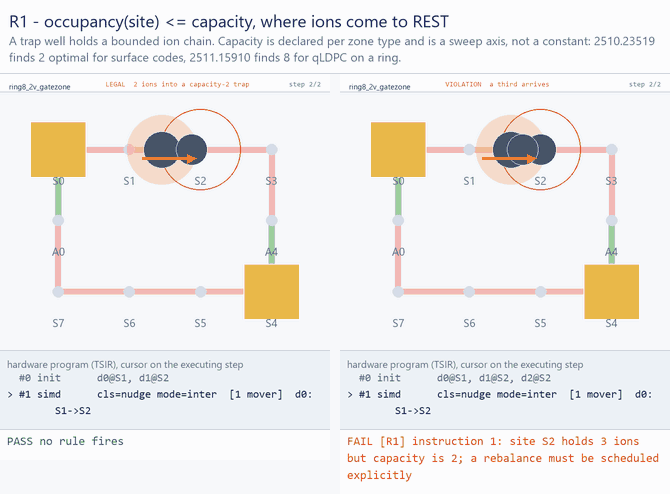

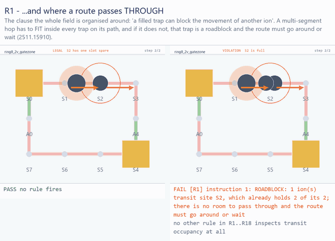


**R2** — a junction is exclusive. Two clauses: ≤ 1 ion resting on a degree-≥3 node, and ≤ 1
ion crossing one per cycle. The raw note ("every time one ion through junction; EC electrode:
only one direction to another direction") is clause B. **A junction is a router** — its
electrode configuration realises one in-direction→out-direction map per cycle.

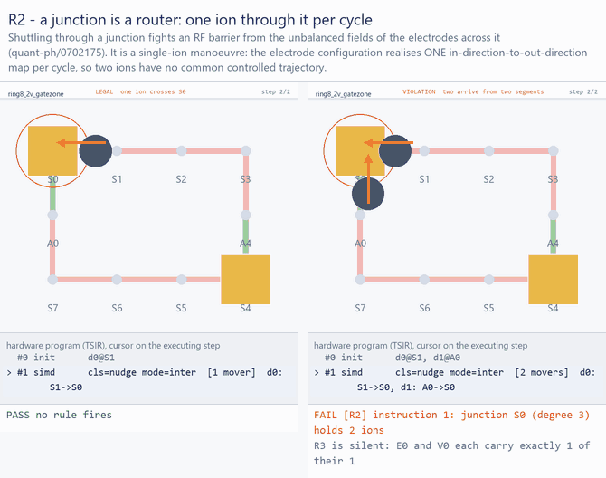


**R3** — ≤ `segment.capacity` ions per segment per cycle. **Not the same as R2** (§4).

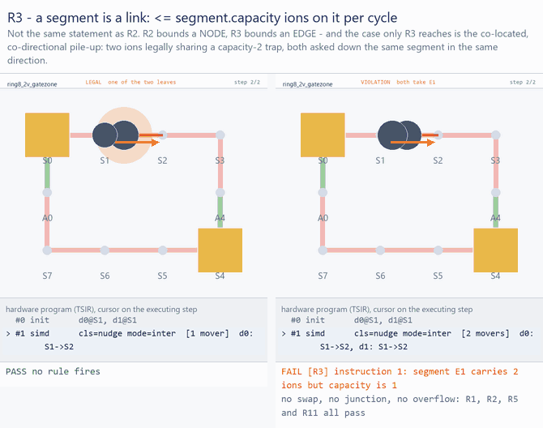


**R4** — the class is declared; ≤ `max_simd_classes_per_cycle` active. This is the broadcast
rule the raw notes emphasise: **declare the movement type (direction, amount) first, then the
participant set**. Distance is unbounded — a shift can cross the whole chip. Two independent
broadcast groups (upper/lower rail) are two classes.

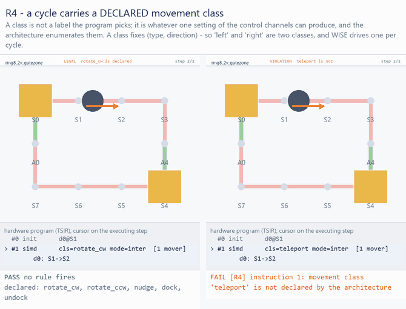

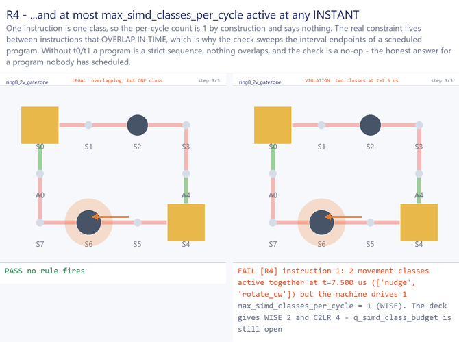


**R4b** — intra- and inter-trap transport never overlap, and **a cycle never mixes transport
with gates** ("when you do transport, you cannot do gates"). Distinct control pathways: DC
electrodes vs lasers.

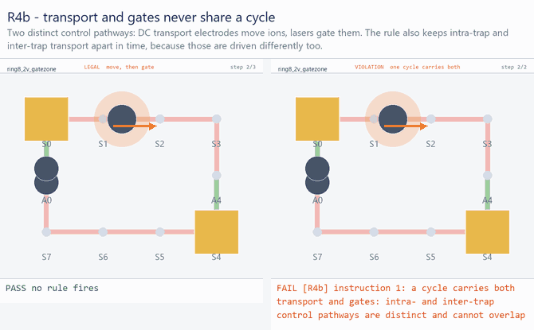


**R4d** — drivable by the declared channel map. This is the "rotation/sidewalk" note: a
junction crossing has to be sequenced before the broadcast shift, because one channel cannot
ask its sites to do two different things at one instant.

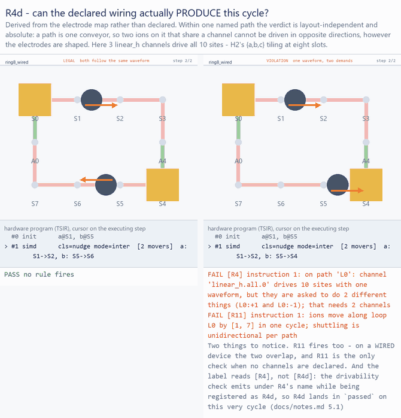

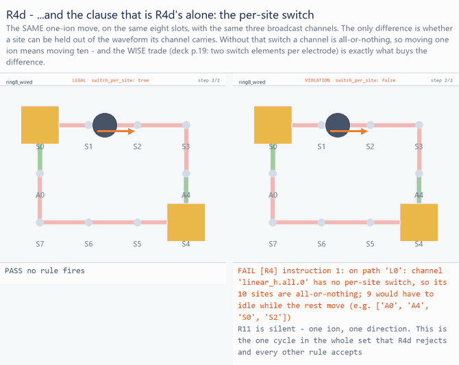


**R5** — no exchange across one segment in one step.

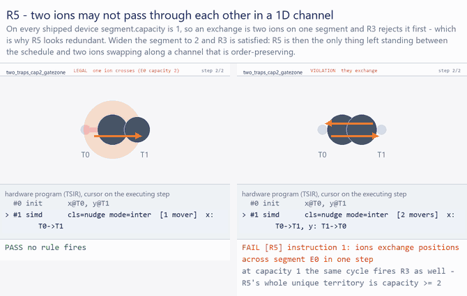


**R6** — gate / measure / cool only where the `zone_type` allows. The raw note is exactly
right: gate zones are **discrete points**, set by where laser power can be delivered, and
data zones are labelled `gate: false`. Measurement and cooling are different wavelengths but
the ADL deliberately abstracts that to capability flags — *"we don't want to be specific
about wavelength, just specify this is cooling."* Cooling is available at every trap.

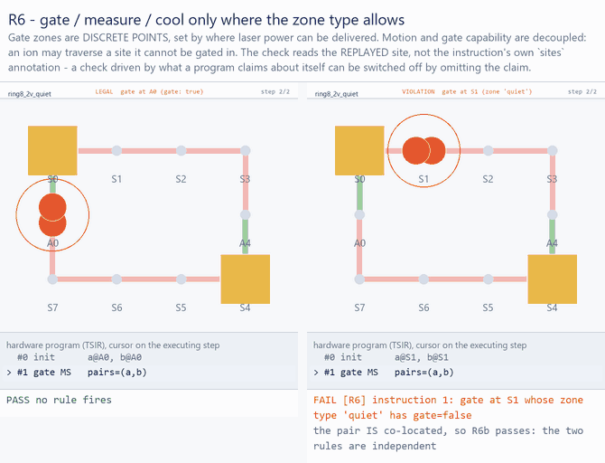


**R6b** — a 2Q pair must be co-located.

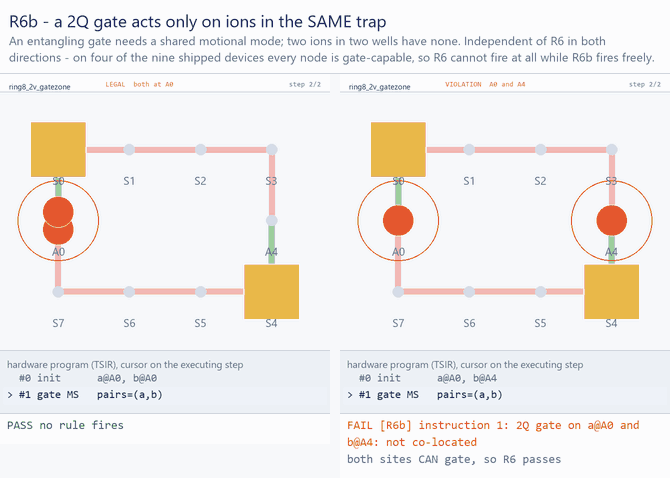


**R7** — n̄ ≤ `ms_gate.max_quanta` at gate time. See §2.3(e): the budget is the point where
heating error equals the floor.

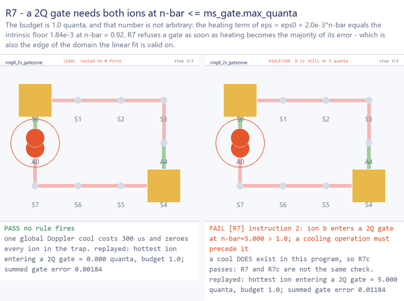


**R7b** — per-zone thermal duty cycle. **Skipped, and not merely unimplemented**: the
parameter is *unrepresentable* — `_ZONE_TYPE` has no such field and `allow_extra` is `False`,
so an architecture that tries to declare one is **rejected by the validator**.

**R7c** — cooling is mandatory. The raw note is the physics: *"heating but no cooling is
wrong — in hardware, in the gate zone you shine another cooling laser."* Cooling is global
(Doppler sheet beams cover the whole trap), which is what makes the scheduling problem
tractable.

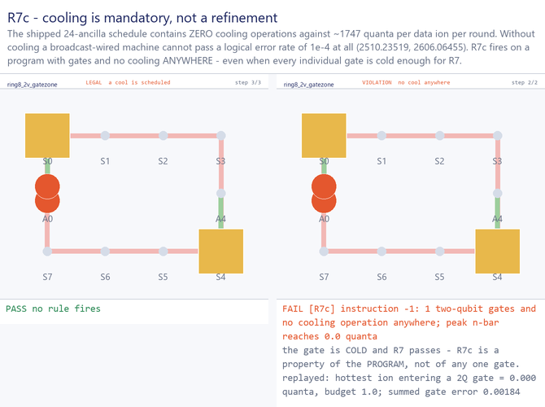


**R8** — ion→site is a bijection over time. Bookkeeping integrity, not hardware.

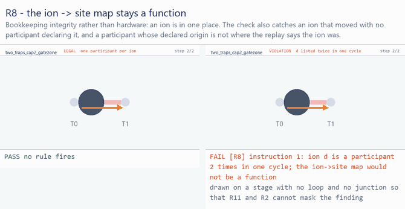


**R9** — claims equal the replay. See §2.1.

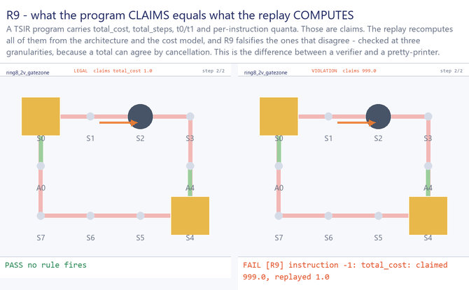


**R10** — the program implements the circuit. `docs/rules.md` still says `skipped`; it is now
discharged by a Lean-4-proved checker in `Compiler/`. **The two documents disagree.**

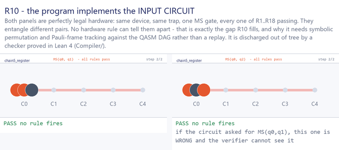


**R11** — (a) shuttling is unidirectional per loop per cycle — *"a ring can only move in one
direction"*; (b) structurally, every junction degree must be **priceable**.

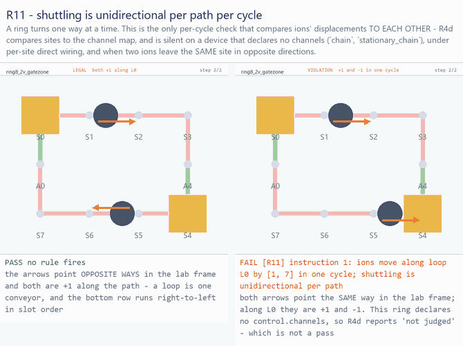


**R12** — intra-trap parallelism = 1. The raw note identifies the mechanism correctly and it
is *not* the same as R4's: **optical** fan-out. Light goes through fibre to a waveguide
beneath the trap, and the 1→2ⁿ splitter geometry sets the maximum broadcast. R12 is the
optical analogue of R4, hardcoded to 1.

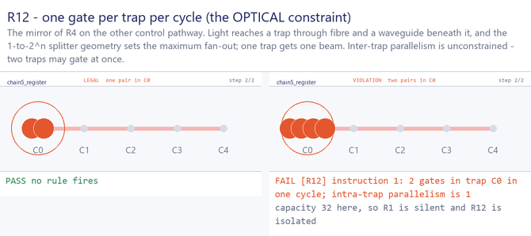


**R13** — ≤ ~15 ions in a trap at gate time. Mechanism in §2.3(b)(3).

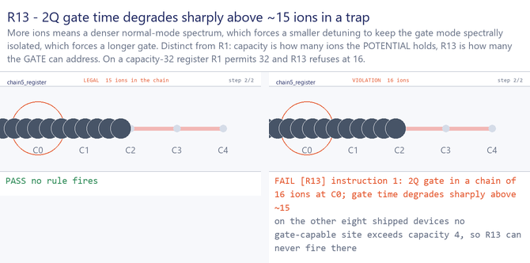


**R14** — an ion must be at a chain edge to split; getting there costs a 3-CX swap. The raw
note has the hardware right: ions sit in a harmonic well, the DC electrodes are reshaped into
a double well, and the chain separates. At capacity ≤ 2 every ion is already at an edge and
the swap is free — **the rule exists so that raising capacity in a sweep does not silently
stop paying it.**

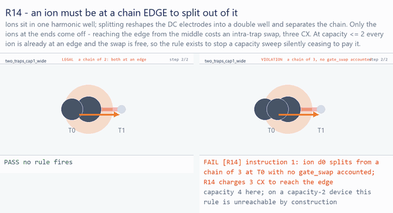


**R15 / R16 / R17 / R18** — see §2.2 and §2.3. All four are **contracts on the cost model**,
not constraints on a program. No schedule can violate them, so there is no
illegal stage to draw: what they constrain is a *curve*, and every point below is computed
by calling the shipped model.

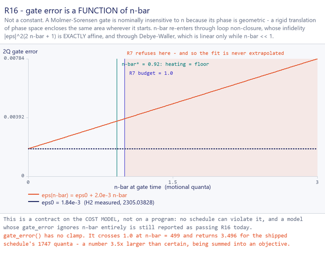

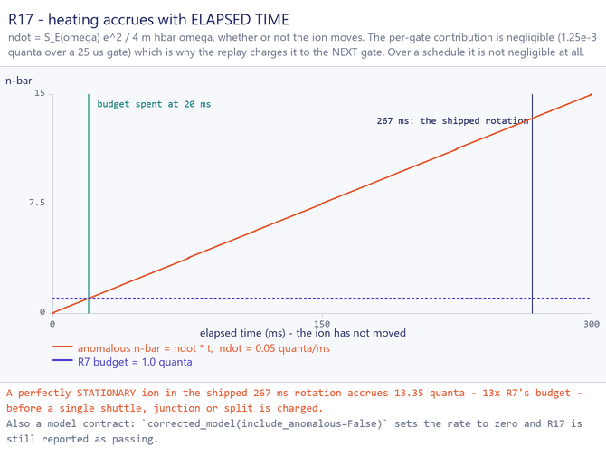

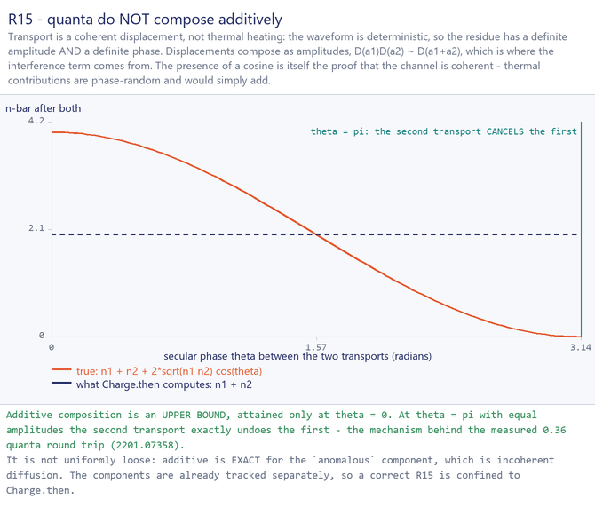

R18's figure is the degree figure in §1 — which is the point: R18 has no program variable
to draw, only a graph property to read off.

---

## 4. The audit: is every rule necessary? Is anything redundant?

Method: for each rule, construct a program that violates it and **check which rules fire**.
A rule is *load-bearing* if some program trips it and nothing else. All rows below were run.

### 4.1 Isolation results **[verified]**

| witness | fires | isolated |
|---|---|---|
| 2 ions from one site down one segment | `R3` | ✅ |
| 2 ions into one junction on **two** segments | `R2` | ✅ |
| 2 ions crossing a degree-4 grid junction on 4 disjoint segments | `R2` | ✅ |
| swap across a **capacity-2** segment | `R5` | ✅ |
| swap across any **shipped** (capacity-1) segment | `R3 R5` (+`R11` on a loop) | ❌ |
| opposite directions on one loop, different segments, **undeclared channels** | `R11` | ✅ |
| same, on `ring144_24v` (channels declared) | `R4 R11` | ❌ |
| 16 ions gated in a capacity-32 register | `R13` | ✅ |
| pair split across two gate-capable ancillas | `R6b` | ✅ |
| pair co-located in a `gate:false` zone | `R6` | ✅ |
| two pairs gated in one capacity-32 trap | `R12` | ✅ |
| undeclared movement class | `R4` | ✅ |
| transport + gate in one cycle | `R4b` | ✅ |
| two classes overlapping in time | `R4` | ✅ |
| intra + inter overlapping in time | `R4b` | ✅ |
| one ion listed twice in a cycle | `R8` (+`R11`) | ❌ but R8 alone names it |
| 3 ions into a capacity-2 site | `R1` (+`R11`) | ❌ fixture artifact |
| `via` through a full trap, no gate anywhere | `R1` | ✅ |
| split from a chain of 3 with no `gate_swap` | `R14` | ✅ |
| gate at n̄ = 5 | `R7 R7c` | ❌ |
| **cold** gate, zero cooling anywhere | `R7c` | ✅ |
| false `total_cost` claim | `R9` | ✅ |

**Every rule with a per-cycle implementation is load-bearing on some shipped device except
R5** (see below). Nothing in the set is dead weight.

### 4.2 The three redundancy claims from the discussion

**"R3 is the same as R2" — no. Independent, both directions, unconditionally.**
R2 ⊄ R3 is airtight: two ions crossing a degree-4 grid junction from different axes use four
*distinct* capacity-1 segments, each at 1/1, and the cycle is still illegal. A junction is a
router; per-link capacity cannot express that. R3 ⊄ R2 is the co-located, co-directional
pile-up (two ions at S1 both moving S1→S2), which no other rule reaches.
**One line each for the docs:** *R2 = "a junction is a router: one ion through it per cycle,
whatever its segments can hold"*; *R3 = "a segment is a link: at most `segment.capacity` ions
on it per cycle, junction or no junction."*
⚠️ The reason this looked redundant is a **test artifact**: `test_r3_fires_when_a_segment_carries_two_ions`
is a head-on **swap**, so it fires `R3 R5 R11` and never demonstrates R3 catching anything
alone. Same fixture in `test_commonsense.py`. Fix both.

**"R5 is redundant with R4" — right conclusion, wrong reason, and the real answer is R3.**
Two layers:

- *Implementation.* `r4_simd_classes` only checks that `instr.cls` is declared; it never looks
  at the moves. So R4-as-implemented cannot imply R5. What actually implies R5 on every
  shipped device is **R3**: at `segment.capacity == 1` an exchange is necessarily two moves on
  one segment. All nine devices have capacity 1 on every segment, so **R5 currently fires only
  in company with R3 — "none found" for an R5-only witness on the shipped fleet.**
- *Rule.* R4 **as stated** — "a class fixes (type, direction)", `max_simd_classes_per_cycle = 1`
  — does entail R5 at the shipped operating point, because two opposite directions are two
  classes. So the note is right at the rule level and the implementation is what diverges.
  At `k ≥ 2` (the deck gives WISE 2, C2LR 4 — `q_simd_class_budget`) that entailment
  disappears.

**Verdict: keep R5, re-file it against R3 and against R4-at-k≥2, never against
`r4_simd_classes`.** Restate it so it says what it uniquely says — *"no two hops traverse one
segment in opposite directions in one cycle: a 1D channel is order-preserving"* — and document
that it is R3's shadow on today's fleet and the only guard at `segment.capacity ≥ 2`. Deleting
it would be a bug the moment a sweep widens a segment.

**"R11 is redundant" — half true, and the half that survives is the important one.**

- R11(b), the structural half, is an **architecture** check with no program at all. It cannot
  be redundant with anything per-cycle. Consider renumbering it.
- R11(a) vs R4d: on `ring144_24v` **[verified]** both fire on the same violation, so R4d does
  subsume R11(a) there. But R4d is silent in three situations that ship today:
  1. **no `control.channels` declared** — `chain`, `stationary_chain`. R11(a) fires, R4d
     returns `[]` at its guard. **[verified]**
  2. **per-site `direct` wiring** — `drivable` is a tautology when every channel drives one
     site;
  3. **two ions leaving the same site in opposite directions** — `path_actions` is keyed by
     source, so the second move **overwrites the first**. **[verified]** on `ring144_24v`,
     `a: S102→S101` + `b: S102→S103` gives `path_actions == {'L0': {'S102': +1}}`, R4d emits
     **zero** violations, and the control panel reports `feasible=True` for a cycle asking one
     trap to push one ion left and one right at the same instant. Only R11(a) catches it.
- Conversely R4d catches something R11 cannot: *"some sites would have to idle while their
  channel-mates move"* (the `switch_per_site: false` branch). No shipped architecture
  exercises that branch.

**Verdict: keep both.** R11(a) is the only per-cycle check that compares ions' displacements
**to each other**; R4d compares **sites to the channel map**.

### 4.3 The other pairs examined

| pair | verdict | why |
|---|---|---|
| R12 vs R4 / R4b | **independent, structurally** | domains are disjoint over `INSTRUCTION_TYPES` — R12 dispatches on `type=="gate"`, R4/R4b on `type=="simd"`. No program on any device can make both fire on one instruction. Verified on all nine devices. |
| R13 vs R1 | **independent, but only on one device** | on a gate cycle `occ_after == occ_before`, so for any capacity ≤ 15 R13's rejection set is a **strict subset** of R1's — enumerated over cap 1..15 × occ 0..39, zero states fire R13 alone. R13 is live because `stationary_chain` ships a `register` zone at capacity 32 — **[verified]** the only gate-capable site above capacity 4 on any of the nine devices. Two different facts about one trap: how many ions the potential holds (R1) vs how many the MS gate can address (R13). |
| R6b vs R6 | **independent on the whole fleet** | **[verified]** R6's gate clause *cannot fire at all* on `chain72`, `cyclone_base`, `h2_racetrack`, `stationary_chain` — every node on those four is gate-capable — while R6b fires freely; R6 fires without R6b on the other 5. Do not merge: a merged "R6: passed" would certify only one half, with nothing in the summary saying which. |
| R7 vs R16 vs R7c | **all three needed** | R16 is a *model* assertion, so "redundant with R7" is a category error. R7 ⊬ R7c and R7c ⊬ R7 both have isolating witnesses — R7c fires on a **cold** gate with no cooling, R7 fires on a hot gate in a program that does cool. R7's real job is not a physical cliff: it is the **domain marker for R16's fitted curve** (§2.3e). |
| R15/R16/R17/R18 | **not redundant — but not rules either** | none constrains a program; all four are cost-model contracts, and none can currently fail. See §5. |

---

## 5. Defects found while auditing (all **[verified]** by running)

These are the actionable output. None changes a design conclusion; several are false greens,
which the repo's own contract calls worse than no verifier.

1. **`r4_drivable` labels its violations `"R4"`, but is registered under the key `"R4d"`.**
   On the cycle where it produced 32 violations, `failed == ['R11','R4']` and **`'R4d'` is in
   `passed`**. Emit `Violation("R4d", …)`.
2. **`only_rules=["R4b"]` reports R4b as *passed* on a program that violates R4b.**
   `concurrency_violations` — the temporal half of *both* R4 and R4b — is gated on `"R4"`
   alone.
3. **`path_actions` drops a second move out of the same site** (dict keyed by source). R4d
   goes silent and the control panel says `drivable`. Key by `(src, ion)` or accumulate a set
   of deltas.
4. **R4's per-cycle budget clause `if 1 > limit` is unreachable** — the schema declares
   `min: 1`, so `max_simd_classes_per_cycle = 0` is rejected at load. The real R4 budget check
   is the temporal one.
5. **`init` and `barrier` build no `CycleView`, so no rule runs on them.** A program that
   inits 5 ions into a capacity-2 trap, or 2 ions onto a degree-3 junction, fires **nothing**.
   Append any other instruction and R1 fires correctly. R1/R2 are necessary and currently
   under-applied.
6. **`gate_sites()` unions the declared `sites` annotation into the replayed positions**, so
   R6/R13 do not evaluate "at the replayed site" as `rules.py` and `docs/rules.md` both claim.
   Conservative (over-rejection only), but the documented contract is wrong.
7. **R16 and R17 are self-certified.** `verify` reads a boolean the model declares about
   itself (`models_heating`) and writes them into `checked`. A `CorrectedModel` subclass whose
   `gate_error` ignores n̄ entirely still reports **R16 passed**; the shipped, supported
   `corrected_model(include_anomalous=False)` does the same for R17 with no subclassing. Both
   have cheap real probes: `model.gate_error(arch,1.0) > model.gate_error(arch,0.0)`, and
   `anomalous_per_us > 0` whenever `arch.anomalous_rate() > 0`.
8. **R17 is gated on `models_heating` but skipped with the message "does not model elapsed
   time"** — and `docs/rules.md` says it is checked when the model models *time*. Three
   descriptions, two behaviours.
9. **R15 is reported `partial` *and* `passed` simultaneously.** `passed()` filters `failed`
   and `skipped` but not `partial`, so R15 appears in the `passed` list three lines above the
   contract saying a rule passes only if the check ran. `PARTIAL` is also applied
   unconditionally — under `DeckModel`, which deposits no quanta at all, R15 still claims to
   be partially checked.
10. **R18 is `rules.checked.add("R18")`** and nothing else — §2.2.
11. **R13 fires on single-qubit gates** with a message that says "2Q gate". Gate it on
    `iter_pairs` the way R7 does.
12. **`gate_error` has no validity domain** and returns 3.496 for the flagship schedule
    — §2.3(e).
13. **κ = 2.0e-3 is unsourced.** It appears in nine arch files, `PLAN.md` and `models.py`; the
    `source: 2305.03828` on the block covers `fidelity_at_n0`, and the note is silent on κ.
    PLAN §12 states the goal of keeping `query.py unsourced` at zero.
14. **`R4d` appears in no rule table.** `docs/rules.md` has 22 rows and no R4d row; PLAN §5
    runs R1…R17 and has neither R4d nor R18. `README` and `qccd/README` say "23 rules".
15. **R10 is documented as `skipped` in `docs/rules.md` and as `passed` in `Compiler/README`.**
16. **`R14` blames the wrong hop on a multi-segment route** — `ResolvedMove` carries `entails`
    on every segment while the cost model charges it only on the first.

---

## 6. Recommendations

**On necessity and redundancy — the headline: nothing should be deleted.** Every rule with an
implementation catches something no other rule catches, on some device the repo ships. The
three suspected redundancies resolve as: R3/R2 genuinely independent (the appearance came from
a bad test); R5 subsumed **by R3, not R4**, on today's fleet only, and load-bearing the moment
a segment widens or `k ≥ 2`; R11(a) subsumed by R4d **only where channels are declared**, which
is 7 of 9 devices, and the sole check on the other 2.

What the audit says to change is not the rule *set* but its **filing and its honesty**:

1. **Give the rule list a taxonomy** — program invariant / architecture / cost-model contract /
   self-consistency / circuit correctness (§3). Most of the felt redundancy is cross-kind
   confusion: R16 "overlapping" R7, R18 "overlapping" R2.
2. **Add `constructed` and `vacuous` report states** to `RuleReport`, so R15/R16/R17/R18 stop
   appearing in `passed`. The browser engine already has both; this closes a real divergence.
3. **Make R16/R17/R18 fail** with the three-line probes in §5(7) and §2.2.
4. **Fix the four false greens** — §5(1), (2), (3), (9).
5. **Rewrite the R3 and R5 negative tests so each fires exactly one rule.** The
   isolation assertions from §4.1 are now permanent regressions in
   [tests/test_rule_figures.py](../tests/test_rule_figures.py): every figure's declared
   verdict is re-checked against the verifier, and `test_every_implemented_rule_has_an_
   isolating_figure` fails if any per-cycle rule loses the programme that trips it alone.
   That is what pins this audit. The remaining work is in `tests/test_rules.py` itself,
   whose R3 fixture is still a swap.
6. **Declare `error_vs_quanta`'s validity domain** and make `gate_error` refuse above it. The
   coupling between `max_quanta` and κ is the entire argument for using a linear law and it is
   nowhere in the schema.
7. **Bring the docs into line**: add R4d and R18 rows, reconcile R10, and state that
   `gate_sites` is replayed ∪ declared.

## 7. Still open

- `q_simd_class_budget` — is `max_simd_classes_per_cycle` really 1? It decides whether R5 is
  entailed by R4 at the rule level (§4.2).
- `q_heating_rate_measurement` — the two primitive tables differ by 2–3×. Blocks a real R15.
- The secular-phase model R15 needs. Note that a correct R15 is confined to `Charge.then`, and
  that `anomalous` should stay additive because it is exactly additive (§2.3d).
- `q_inline_vs_hanging_ancillas` — decided by R18 in principle (§2.2); confirm by compiling
  both.
- Whether R13 should be a **rule** at all, or a chain-length term in the gate-duration curve
  with the cliff declared by the architecture rather than hardcoded as `limit=15`. "Gate time
  degrades sharply" is a cost statement, not a legality statement.

---

## 8. How the figures are made

[`tools/make_rule_figs.py`](../tools/make_rule_figs.py) with the table in
[`tools/rule_figs_spec.py`](../tools/rule_figs_spec.py). Rebuild everything with:

```bash
python tools/make_rule_figs.py --all          # -> docs/img/rules/
python tools/make_rule_figs.py --only R3 R5   # just these
python tools/make_rule_figs.py --list         # what would be built
```

It is **not a second renderer** — geometry comes from `qccd.viz.layout.compute_layout`,
frames from `qccd.viz.render.build_view_model`, and the stage is advanced by
`make_gif.Clip`, the same object the gallery clips use. It adds exactly three things:
node labels, a highlight ring, and a verdict band.

The design rule that makes the figures worth trusting: **no caption is written by hand.**
The red line under a violating panel is `str(Violation)` straight out of `verify()`; the
degree histograms, junction sets, corner segments and per-ion n̄ are read off the device
and the replay. And every `Case` declares the rule set it expects, so a figure whose
verifier disagrees is *refused* rather than emitted:

```
R3_segment_capacity          REFUSED: VIOLATION: expected rules ['R3'] to fire, got ['R3', 'R5', 'R11']
```

Two things fell out of building them, which is the argument for building them at all:

- **R4d had no isolating figure**, because it emits under R4's name *and* R11 co-fires on
  any wired device. Hunting for one produced `R4d2_switch_per_site` — the same one-ion
  move, legal with per-site switches and illegal without — which is the only cycle in the
  whole set that R4d rejects and every other rule accepts. It is also the WISE trade in
  one picture.
- **The R4d figure displays defect §5.1 directly**: the violation reads `[R4]`, not
  `[R4d]`.
